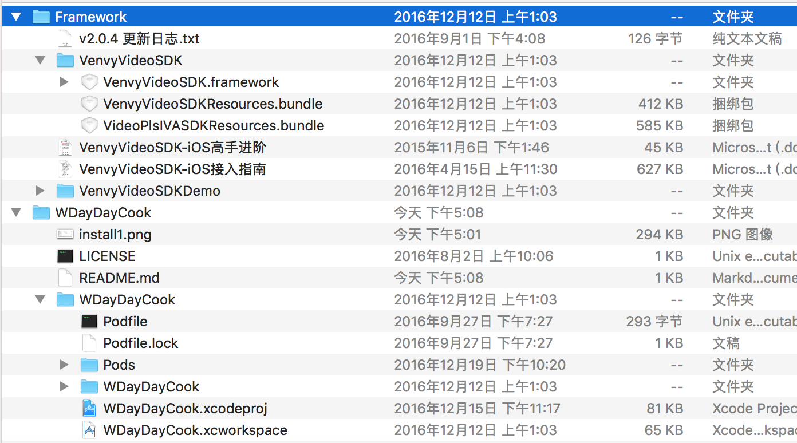

# WDayDayCook
一个仿DayDayCook的纯Swift项目
##  项目介绍
- 项目最初是有swift2写的,在苹果发布swift3的时候升级到了swift3
- 项目原本是按照 日日煮 六七月份的时候界面做的,由于官方更新的缘故,和现在的版本有些许差异
## 用到的开源库
### cocoacods安装
-  SnapKit  自动布局
-  Alamofire 网络请求, swift版的AFN
-  Kingfisher ## 轻量级的SDWebImage
-  SwiftyJSON
-  RealmSwift
-  ObjectMapper
-  SDCycleScrollView
-  AlamofireObjectMapper

### 本地导入
- VenvyVideoSDK

都是用的比较火的开源框架,大家可以github自己搜索

## 如何安装
- 1、克隆项目到本地
```
git clone https://github.com/wowiwj/WDayDayCook.git
```
- 2、下载播放视频sdk
  - 下载链接
  
    <https://vplscdn.videojj.com/sdk/Videojj_SDK_iOS_v2.0.5.zip>
 - 安装
   - 第一种方法
   直接拖到项目的Framework目录
    
   - 第二种方法
   和项目放到平齐目录,目录结构如下
    
- 3、然后进入podfile目录,执行
```
 pod install
```
### 项目截图


   
   